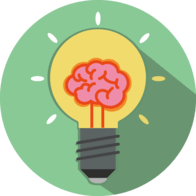

<div align="center">
  <a href="https://github.com/gangjun06/ideaslab">
    
  </a>
  <h3>아이디어스 랩</h3>
</div>

<h4 align="center">
  <a href="https://discord.gg/XepQjgpbum">디스코드</a> |
  <a href="https://www.craft.do/s/k1Hc9FX9indB84">문서</a> |
  <a href="https://ideaslab.kr">웹사이트</a>
</h4>

<details>
  <summary>목차</summary>
  <ol>
    <li>
      <a href="#📖 프로젝트 소개">📖 프로젝트 소개</a>
      <ul>
        <li><a href="#전체기능">전체 기능</a></li>
      </ul>
    </li>
  </ol>
</details>

## 📖 프로젝트 소개

아이디어스 랩은 10여가지 다양한 분야의 창작자들이 모여 작업, 아이디어 논의, 프로젝트 진행 등을 할 수 있는 커뮤니티성 친목 서버입니다.

본 프로젝트는 디스코드 서버의 활동을 더욱 풍성하게 만들기 위해 개발된 프로젝트입니다.

웹사이트/봇 등을 통해 서버 내부의 정보를 제공하고, 서버 내부의 활동을 웹사이트에서도 확인할 수 있습니다.

### 전체 기능

#### 웹

- 아이디어스랩 소개 웹페이지
- 회원가입 설문지
- 디스코드 - 웹사이트 연동
- 갤러리 및 사용자 프로필 웹페이지

#### 봇

- 웹으로의 데이터 제공
- 음성채널 관리
- 사용자의 활동 기록
- 건의함 (티켓기능)

## 🚀 시작하기

[아이디어스 랩 디스코드](https://discord.gg/XepQjgpbum)에 가입하셔서 바로 사용하실 수 있습니다.

### 개발서버

```bash
# Start dev server
docker-compose -f -d docker-compose.dev.yml up --build --force-recreate

# Show Logs
docker-compose -f docker-compose.dev.yml logs -f <main | nginx>

# Stop dev server
docker-compose -f docker-compose.dev.yml down
```

## 📦 프로젝트 구성

### 사용된 기술

### 공통

Turbopack, zod, redis

### 웹

Next.js, Tailwind css, react-hook-form, trpc (react-query), jotai

### 백엔드 & 봇

Trpc, Discord.js, Prisma

### 폴더 구조

> 💡 자세한 구조는 각 폴더별 README를 참고하세요

```
apps/ # 프로젝트의 앱들
  - web/ # 웹
  - server/ # 백엔드 & 봇

packages/ # apps에서 사용하는 패키지들
  - db/ # Prisma DB
  - eslint-config/ # eslint 설정
  - tsconfig/ # TS 설정
  - validator/ # zod 스키마
```

## 🌱 기여

## 📝 라이선스
